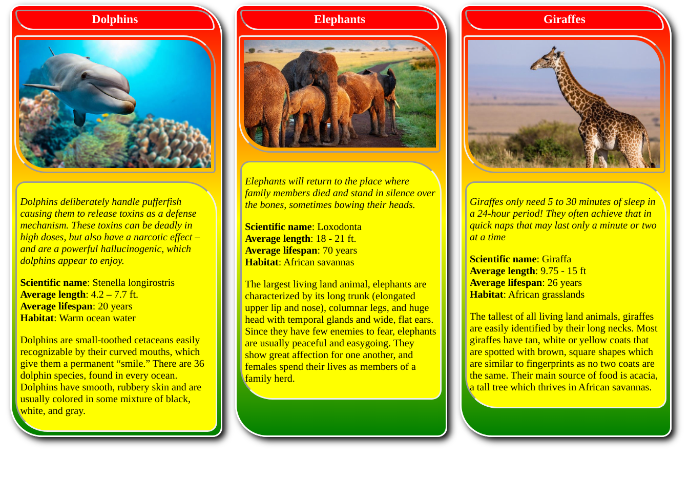

# Animal-Trading-Cards
Animal Trading Card project from Udacity's Frontend Web Dev nanodegree program.

    

## Description 
The assignment was to make a trading card set to certain specifications. I decided to do more and added two extra animals and some optional CSS styling. The colors represent my heritage, Jamaican and Ethiopian. The animals I chose are unique like me and I'm really glad with the finished project. It's easy on the eyes and very informative! I bet you'll learn something new.

### Features

- Clean, readable code
- Can easily add more animal cards
- Fully customizable

### Built with

- HTML
- CSS
- Love

### Usage

Many different uses, ie games, educational, informative decal

### Acknowledgements

Thanks to my classmates who helped inspire this template.

### To-do

- [ ] Complete more projects
